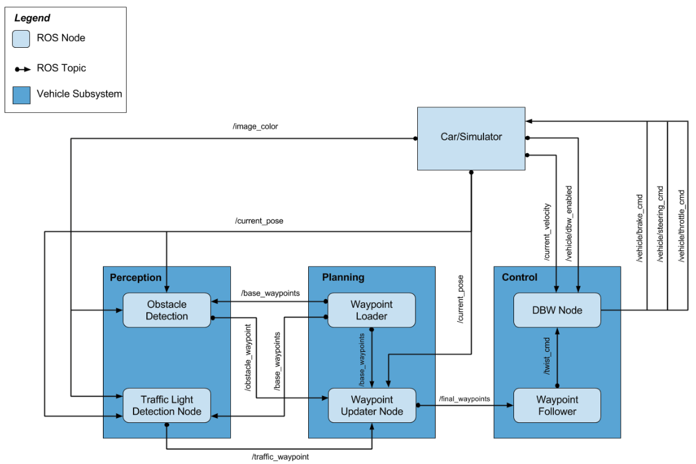

# The Swift
### Swift Team
* Tom Odwald: Tomasz.Odwald@gmail.com
* Vinod Radhakrishnan: vinod_rad@yahoo.com
* Alex Santos: alejandro.diaz.santos@gmail.com
* Elias Zimmermann: elias.zimmermann@rafi.de
* Anup Nayak: anup.nayak@gmail.com


## Introduction
The goal of this Capstone project was to provide a system which integrates multiple components to drive the Udacity self-driving car "Carla" around a test track.

To achieve this goal we enhanced the baseline code provided by Udacity and made improvements to all 3 logical subsystems.
1. Perception, by implementing a Deep-Neural Network based traffic light detection algorithm
2. Planning, by improving the waypoint estimation algorithm to provide responsive and smoooth velocity profiles, and 
3. Control, by providing actuator control commands which adhere to the planned waypoints with minimal jerk.

The following subsections will detail the improvements for each category.




### Perception
#### Obstacle Detection
No changes were made to this module.
#### Traffic Light Detection
For the traffic light detection there are two steps needed: 
1. Detecting a traffic light 
2. Classification of the traffic light. 
We decided to create a single shot detector including both steps in one.

The resulting model is based on the Tensorflow API. A pretrained object detection model named 'ssd_mobilenet_v1_coco' is provided in this API. Using the Bosch Small Traffic Lights Dataset the model is trained to fullfil our requirements for the test track. To test the source code on a simulator a further model is provided which used the Udacity Simulator based traffic light data to train it.

A link to this work is provided [here]( https://github.com/alejandrods/Tensorflow_API_traffic_light_detection/blob/master/object_detection_tutorial.ipynb).

### Planning
#### Waypoint Loader
We updated the waypoint loader launch file to specify the number of waypoints published to the waypoint-follower node, as well as the number of waypoints we use to lookahead for traffic lights. After some experimentation, these values are set as follows:

1. For the simulator track, we publish 30 waypoints to the waypoint-follower node, while simultaneously using 125 waypoints of lookahead for Traffic Lights so we can provide a longer response window and smoother deceleration when a yellow or red traffic signal is detected.
1. For the site track, we use 10 waypoints for both publishing to the waypoint-follower node, and as lookahead for Traffic Lights.

#### Waypoint Updater
TODO : Vinod
 
### Control
#### DBW
TODO : Vinod
 
#### Waypoint follower
No chnages.

### Usage

1. Clone the project repository
```bash
git clone https://github.com/AnupNayakGitHub/CarND-Capstone
```

2. Install python dependencies
```bash
cd CarND-Capstone
pip install -r requirements.txt
```
3. Make and run styx
```bash
cd ros
catkin_make
source devel/setup.sh
roslaunch launch/styx.launch
```
4. Run the simulator

### Real world testing
1. Download [training bag](https://s3-us-west-1.amazonaws.com/udacity-selfdrivingcar/traffic_light_bag_file.zip) that was recorded on the Udacity self-driving car.
```bash
wget https://s3-us-west-1.amazonaws.com/udacity-selfdrivingcar/traffic_light_bag_file.zip
```
2. Unzip the file
```bash
unzip traffic_light_bag_file.zip
```
3. Play the bag file
```bash
rosbag play -l traffic_light_bag_file/traffic_light_training.bag
```
4. Launch your project in site mode
```bash
cd CarND-Capstone/ros
roslaunch launch/site.launch
```
5. Confirm that traffic light detection works on real life images

## Conclusion
We took the opportunity to build a small team working from different time zone. Our approach was for each team member to learn from every part of change and improvement. We periodically identified next set of improvements and each member to work on identifed improvements. At the same time, periodically reviewed the recent improvements and merged to retain the best solution. This excercise exposed each of us to all parts of the project.

# Original

This is the project repo for the final project of the Udacity Self-Driving Car Nanodegree: Programming a Real Self-Driving Car. For more information about the project, see the project introduction [here](https://classroom.udacity.com/nanodegrees/nd013/parts/6047fe34-d93c-4f50-8336-b70ef10cb4b2/modules/e1a23b06-329a-4684-a717-ad476f0d8dff/lessons/462c933d-9f24-42d3-8bdc-a08a5fc866e4/concepts/5ab4b122-83e6-436d-850f-9f4d26627fd9).

Please use **one** of the two installation options, either native **or** docker installation.

### Native Installation

* Be sure that your workstation is running Ubuntu 16.04 Xenial Xerus or Ubuntu 14.04 Trusty Tahir. [Ubuntu downloads can be found here](https://www.ubuntu.com/download/desktop).
* If using a Virtual Machine to install Ubuntu, use the following configuration as minimum:
  * 2 CPU
  * 2 GB system memory
  * 25 GB of free hard drive space

  The Udacity provided virtual machine has ROS and Dataspeed DBW already installed, so you can skip the next two steps if you are using this.

* Follow these instructions to install ROS
  * [ROS Kinetic](http://wiki.ros.org/kinetic/Installation/Ubuntu) if you have Ubuntu 16.04.
  * [ROS Indigo](http://wiki.ros.org/indigo/Installation/Ubuntu) if you have Ubuntu 14.04.
* [Dataspeed DBW](https://bitbucket.org/DataspeedInc/dbw_mkz_ros)
  * Use this option to install the SDK on a workstation that already has ROS installed: [One Line SDK Install (binary)](https://bitbucket.org/DataspeedInc/dbw_mkz_ros/src/81e63fcc335d7b64139d7482017d6a97b405e250/ROS_SETUP.md?fileviewer=file-view-default)
* Download the [Udacity Simulator](https://github.com/udacity/CarND-Capstone/releases).

### Docker Installation
[Install Docker](https://docs.docker.com/engine/installation/)

Build the docker container
```bash
docker build . -t capstone
```

Run the docker file
```bash
docker run -p 4567:4567 -v $PWD:/capstone -v /tmp/log:/root/.ros/ --rm -it capstone
```

### Port Forwarding
To set up port forwarding, please refer to the [instructions from term 2](https://classroom.udacity.com/nanodegrees/nd013/parts/40f38239-66b6-46ec-ae68-03afd8a601c8/modules/0949fca6-b379-42af-a919-ee50aa304e6a/lessons/f758c44c-5e40-4e01-93b5-1a82aa4e044f/concepts/16cf4a78-4fc7-49e1-8621-3450ca938b77)

### Usage

1. Clone the project repository
```bash
git clone https://github.com/udacity/CarND-Capstone.git
```

2. Install python dependencies
```bash
cd CarND-Capstone
pip install -r requirements.txt
```
3. Make and run styx
```bash
cd ros
catkin_make
source devel/setup.sh
roslaunch launch/styx.launch
```
4. Run the simulator

### Real world testing
1. Download [training bag](https://s3-us-west-1.amazonaws.com/udacity-selfdrivingcar/traffic_light_bag_file.zip) that was recorded on the Udacity self-driving car.
```bash
wget https://s3-us-west-1.amazonaws.com/udacity-selfdrivingcar/traffic_light_bag_file.zip
```
2. Unzip the file
```bash
unzip traffic_light_bag_file.zip
```
3. Play the bag file
```bash
rosbag play -l traffic_light_bag_file/traffic_light_training.bag
```
4. Launch your project in site mode
```bash
cd CarND-Capstone/ros
roslaunch launch/site.launch
```
5. Confirm that traffic light detection works on real life images
